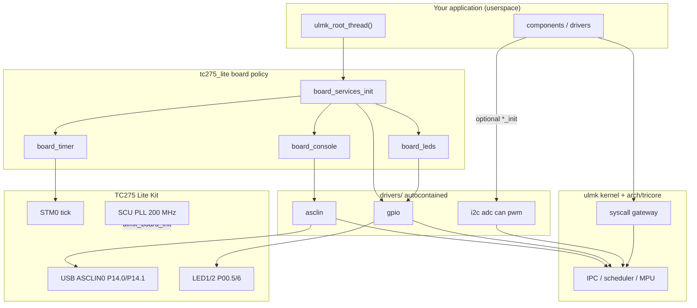

# AURIX TC275 Lite Kit — ulmk board support

Board support package (BSP) for the
[Infineon AURIX TC275 Lite Kit](https://www.infineon.com/KIT_AURIX_TC275_LITE)
(`KIT_AURIX_TC275_LITE`, SAK-TC275TP-64F200W).  Lives in the sibling
[`ulmk_boards`](../) tree and is consumed by the ulmk kernel via
`-DULMK_CHIP_DIR`.

**Drivers (current):** self-contained client/server modules under `drivers/`
(gpio, asclin, i2c, adc, can, pwm) using Infineon iLLD SFR/inlines as HAL.
Board policy is only `board_console`, `board_leds`, `board_timer`,
`board_services`.  Console is ASCLIN0 userspace (USB VCOM).  **No kernel printk**
— `ulmk_printk_char_out` is a no-op; use `board_console_puts()` from apps.

This BSP does **not** ship a `root_thread`.  Your application (or an ulmk
component such as `hello_world`) provides `ulmk_root_thread()` and calls
`board_services_init(info)` at startup.

## Architecture



| Layer | Responsibility |
|-------|----------------|
| `board_init.c` | CPU0: iLLD WDT EndInit + PLL + CLC enable for BSP peripherals |
| `board_console.c` | Kit wiring: ASCLIN0 + P14.0/1 + RAM log |
| `board_timer.c` | STM0 + `board_timer_sleep_us()` |
| `board_leds.c` | LED1/2 active-low on top of `gpio` |
| `drivers/<name>/` | Public API + client + server; iLLD HAL; pin args in `*_init` |
| `deps/illd_tc2x/` | Infineon [iLLD TC2x V1.22.0](https://github.com/Infineon/illd_release_tc2x) (IFASLL) |

**Single core:** SMP is not supported; bring-up targets **CPU0** only.

**TriCore ISA:** TC275 CPU0 is **TC1.6E (1.6.1)** with **112 KB** DSPR
(`0x70000000`–`0x7001BFFF`).  Do not use the 120 KB / 240 KB figures from
CPU1/CPU2 or from TC3xx (1.6.2) boards — past `0x7001C000` is reserved and
raises Class 4.  QEMU `qemu_tc3xx` remains the 1.6.2 CI target; this BSP is
the silicon 1.6.1 path.

### Infineon iLLD (`deps/`)

```bash
cd deps
git clone --depth 1 --branch V1.22.0 \
  https://github.com/Infineon/illd_release_tc2x.git illd_tc2x
cd illd_tc2x && git sparse-checkout init --cone
git sparse-checkout set src/TC27D \
  examples/BaseFramework_TC27D/0_Src/AppSw/CpuGeneric/Config \
  IFASLL202501.pdf README.md
```

`board_init` uses **header-only** iLLD WDT inlines (`IfxScuWdt_*Inline`) and
enables peripheral CLC (ASCLIN0, STM0, I2C0, VADC, CAN, GTM) under EndInit.
`IfxScuCcu.c` / full `IfxPort.c` / `IfxAsclin.c` are **not** linked into
userspace: those call `mfcr` via EndInit helpers and trap at `ULMK_PRIV_DRIVER`.
Driver servers use iLLD **SFR types + IFX_INLINE** APIs after `ulmk_mem_map`.
License: IFASLL (see `deps/illd_tc2x/IFASLL202501.pdf`); board MIT sources stay separate.

### Using extra peripherals from an app

```c
#include <i2c.h>
#include <adc.h>
#include <can.h>
#include <pwm.h>

void ulmk_root_thread(const ulmk_boot_info_t *info)
{
	i2c_pins_t i2c_pins = { /* SCL/SDA port/pin/alt from your schematic */ };
	adc_channel_t pot = { .group = 0, .channel = 0 };

	board_services_init(info);	/* console + timer + gpio + leds */
	(void)i2c_init(0, &i2c_pins, 100000u);
	(void)adc_init();
	(void)adc_config(&pot);
	/* can_init / pwm_init similarly — pins chosen by the app */
}
```

## Directory layout

```
tc275_lite/
  board.cmake / board_config.h / memory.ld / bmhd.*
  board_init.c / board_services.*
  board_console.* / board_timer.*
  deps/                    Ifx_Cfg.h, illd.cmake, illd_tc2x/ (IFASLL)
  drivers/asclin/          ASCLIN UART (polled 8N1)
  drivers/port/            P14 pin mux for ASCLIN0
  openocd/                 TAS configs + aurix-openocd patch series (upstream PR)
  scripts/                 flash.sh, hil-boot-check.sh, hil-step-test.sh, …
```

## Build (ulmk dev container)

From the **ulmk** repository:

```bash
python3 tools/dev.py

# inside container — enable a component that provides ulmk_root_thread()
python3 tools/dev.py components enable hello_world ping_pong

python3 tools/dev.py build --board /workspace/../ulmk_boards/tc275_lite \
    --component hello_world --component ping_pong
```

On the host (paths relative to your checkout):

```bash
python3 tools/dev.py build \
    --board ../ulmk_boards/tc275_lite \
    --component hello_world --component ping_pong
```

Artifact: `build/ulipe-tricore-tc275_lite/ulmk` (exact subdir name follows the
board directory basename).

## Flash and debug

**Recommended:** use the host install script (handles FTDI, OpenOCD, toolchain):

```bash
cd ulmk_boards/tc275_lite/scripts
./install-host-tools.sh \
  --ftdi-archive ~/Downloads/libftd2xx-linux-x86_64-*.tgz \
  --tas-archive ~/Downloads/DAS_8.3.0_linux_x64.deb
source ~/.local/aurix/env.sh
./start-tas.sh
./flash.sh /path/to/ulmk.elf
```

Full guide: [scripts/README-openocd.md](scripts/README-openocd.md).

Open a serial terminal on the **USB COM port** (115200 8N1) to see
`board_console_puts()` output from userspace — not kernel `ulmk_printk()`.

## Roadmap

| Phase | Status |
|-------|--------|
| 0–1 | PLL, BMHD, STM0, ASCLIN0 console — done |
| 2 | GPIO (LEDs, button), ADC (pot) — done |
| 3 | CAN0 (TLE9251) — done (bring-up loopback API) |
| 4 | I2C + PWM — done (client–server APIs) |

`board_services_init()` starts console + timer + gpio + leds.
Apps call `i2c_init` / `adc_init` / `can_init` / `pwm_init` when needed.

### Blinky + shell

```bash
python3 tools/dev.py build --board ../ulmk_boards/tc275_lite \
  --no-components --component board_blinky
bash ../ulmk_boards/tc275_lite/scripts/hil-board-blinky.sh \
  ../build/ulipe-tricore-tc275_lite/ulmk
```

USB serial 115200 8N1: commands `help`, `status`, `led1 on|off`, `led2 on|off`.
Expect `led1=` lines in the RAM console log (HIL smoke).

## Hardware notes

- **Crystal:** 20 MHz → **200 MHz** CPU (`ULMK_BOARD_FCPU_HZ`); STM @ **100 MHz** (`ULMK_BOARD_FSTM_HZ`).
- **Console:** ASCLIN0 default on **P14.0** (TX) / **P14.1** (RX) per kit manual.
- **Timer:** STM0 base `0xF0000000` (TC27D), SR0 @ SRC `0xF0038490`, SRE bit 10, SRPN 2.
- **BMHD:** `.bmhd` in flash NC alias; CRC must match `_start` — see `bmhd.c`.

## Cert set (with sibling ulmk_apps)

| Component | Script |
|-----------|--------|
| `silicon_baseline` | `scripts/hil-baseline-check.sh` |
| `silicon_e2e` | `scripts/hil-silicon-e2e.sh` |
| `silicon_unit` | `scripts/hil-silicon-unit.sh` |
| `silicon_stress` | `scripts/hil-silicon-stress.sh` |
| `silicon_wcet` | `scripts/hil-silicon-wcet.sh` |
| `board_blinky` | `scripts/hil-board-blinky.sh` |

Order: baseline → e2e → unit → stress → wcet.  Blinky is the BSP demo (not a cert gate).
Expect `SILICON_*: PASS` in the RAM log; blinky smoke looks for `led1=`.

```bash
python3 tools/dev.py build --board ../ulmk_boards/tc275_lite \
  --no-components --component silicon_unit
bash ../ulmk_boards/tc275_lite/scripts/hil-silicon-unit.sh \
  ../build/ulipe-tricore-tc275_lite/ulmk
```

Oracle: RAM console log via JTAG (`g_ulmk_console_log`).  `/dev/ttyUSB0` on the
Lite Kit DAS is not a CDC VCOM for ASCLIN.

## References

- [TC275 Lite Kit user manual](https://www.infineon.com/assets/row/public/documents/10/44/infineon-aurix-tc275-lite-kit-usermanual-en.pdf)
- ulmk: `docs/application_development_guide.md`, `docs/linker_spec.md` §9
